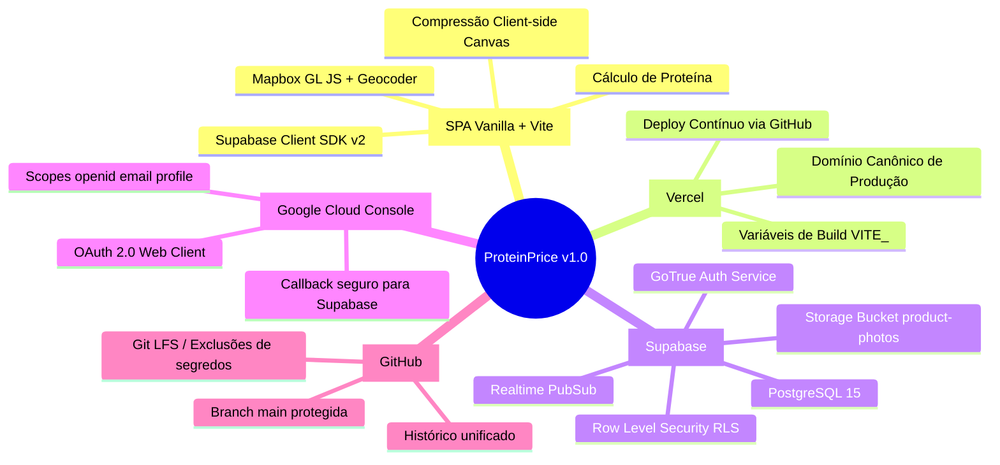
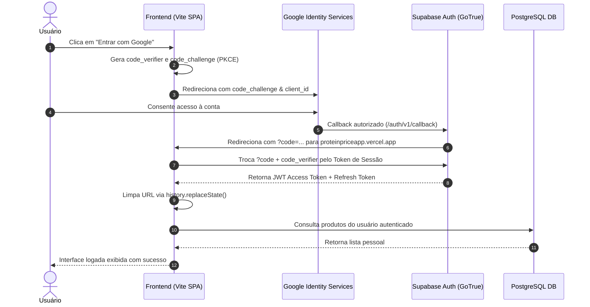
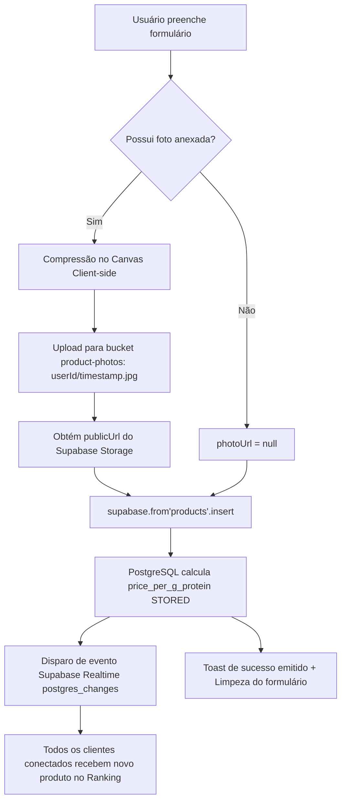

# 📘 ProteinPrice — Relatório Técnico & Arquitetura Oficial (v1.0)

> **Documento Oficial de Engenharia e Entrega da Versão 1.0**  
> **Status:** Produção Estável 🚀  
> **Domínio Oficial:** [https://proteinpriceapp.vercel.app](https://proteinpriceapp.vercel.app)  
> **Repositório:** [github.com/teusbraga/projeto-proteinas](https://github.com/teusbraga/projeto-proteinas)

---

## 1. Visão Geral do Produto

O **ProteinPrice** é uma aplicação web colaborativa desenvolvida para solucionar uma dor real de quem busca bater metas nutricionais: **identificar qual alimento oferece o menor custo financeiro por grama de proteína real**.

A plataforma combina:
1. **Calculadora Dinâmica de Macro/Custo**: Cálculo instantâneo no cliente e garantido por colunas computadas no Postgres.
2. **Ranking Comunitário Público**: Alimentado em tempo real via WebSockets (Supabase Realtime).
3. **Geolocalização Colaborativa**: Mapeamento do ponto de compra através de Mapbox GL JS com geocoder integrado.
4. **Autenticação Segura & Social**: Login com Google via OAuth 2.0 com fluxo moderno **PKCE**.

---

## 2. Mapa Mental dos Sistemas Integrados



---

## 3. Arquitetura de Dados & PostgreSQL (Supabase)

### 3.1 DDL da Tabela Central (`products`)

A grande inteligência do modelo é a coluna `price_per_g_protein`, que é gerada automaticamente pelo motor do PostgreSQL (`GENERATED ALWAYS AS`), garantindo que nenhum cliente consiga fraudar ou calcular incorretamente o preço por grama de proteína.

```sql
CREATE TABLE public.products (
  id                  UUID PRIMARY KEY DEFAULT gen_random_uuid(),
  user_id             UUID NOT NULL REFERENCES auth.users(id) ON DELETE CASCADE,
  name                TEXT NOT NULL,
  brand               TEXT,
  food_type           TEXT NOT NULL CHECK (food_type IN ('animal', 'vegetal')),
  price               NUMERIC(10,2) NOT NULL CHECK (price > 0),
  weight_g            NUMERIC(10,2) NOT NULL CHECK (weight_g > 0),
  portion_g           NUMERIC(10,2) NOT NULL CHECK (portion_g > 0),
  protein_g           NUMERIC(10,2) NOT NULL CHECK (protein_g > 0),
  
  -- Cálculo automatizado e imutável pelo PostgreSQL
  price_per_g_protein NUMERIC(10,4) GENERATED ALWAYS AS (
    ROUND( (price / ((weight_g / portion_g) * protein_g))::numeric, 4 )
  ) STORED,

  photo_url           TEXT,
  store_name          TEXT,
  city                TEXT,
  latitude            DOUBLE PRECISION,
  longitude           DOUBLE PRECISION,
  is_active           BOOLEAN NOT NULL DEFAULT true,
  created_at          TIMESTAMPTZ NOT NULL DEFAULT now(),
  updated_at          TIMESTAMPTZ NOT NULL DEFAULT now()
);
```

### 3.2 Políticas de Segurança RLS (Row Level Security)

| Operação | Política | Condição / Regra |
| :--- | :--- | :--- |
| **SELECT** | Leitura pública | `is_active = true` (Permite visualização sem login) |
| **INSERT** | Escrita autenticada | `auth.uid() = user_id` (Garante autoria) |
| **UPDATE** | Atualização restrita | `auth.uid() = user_id` |
| **DELETE** | Exclusão restrita | `auth.uid() = user_id` |

---

## 4. Fluxograma de Autenticação OAuth 2.0 com PKCE

Substituímos o fluxo implícito tradicional (que expunha tokens no hash `#` da URL) pelo **fluxo PKCE (Proof Key for Code Exchange)**:



---

## 5. Fluxograma de Cadastro de Produto e Cálculo



---

## 6. Dossiê de Erros & Soluções (Troubleshooting Log)

Abaixo está o registro cronológico dos desafios encontrados entre desenvolvimento local, repositório e infraestrutura de nuvem, com o diagnóstico exato e a solução aplicada:

### Erro 1: Erro 400 no Supabase (`missing OAuth secret`)
- **Sintoma:** Ao tentar chamar a autenticação do Google, o Supabase retornava:
  `{"code":400,"error_code":"validation_failed","msg":"Unsupported provider: missing OAuth secret"}`.
- **Causa Raiz:** O provedor Google estava ativado no painel do Supabase, mas os campos **Client Secret** e **Client ID** estavam vazios.
- **Solução:** Criação de credenciais OAuth 2.0 Web Application no Google Cloud Console e preenchimento dos campos correspondentes no Supabase.

---

### Erro 2: Botão de Login sumiu no Vercel (Página travada em Skeletons)
- **Sintoma:** Em produção no Vercel, o botão de login não aparecia e o card de adicionar ficava infinitamente carregando.
- **Causa Raiz:** No Vite, variáveis de ambiente que começam com `VITE_` são embutidas estaticamente no build. Como o `.env.local` não sobe para o GitHub (está no `.gitignore`), a Vercel não tinha os valores de `VITE_SUPABASE_URL` e `VITE_SUPABASE_ANON_KEY`. O arquivo `src/supabase.js` disparava um `throw new Error(...)` na raiz do módulo, abortando a execução de todo o JavaScript.
- **Solução:** Configuração das variáveis de ambiente no painel da Vercel (**Settings** > **Environment Variables**) e acionamento de **Redeploy**.

---

### Erro 3: Erro 406 na Landing Page (`GET /rest/v1/products... limit=1:1`)
- **Sintoma:** O console acusava `status of 406 (Not Acceptable)`.
- **Causa Raiz:** A consulta da melhor proteína em `getStats()` utilizava `.single()`. No PostgREST do Supabase, `.single()` exige que a query retorne estritamente 1 registro. Como a tabela estava vazia no primeiro acesso, o PostgREST devolvia erro 406.
- **Solução:** Substituição do método `.single()` por `.maybeSingle()` em [src/products.js](file:///c:/Users/Mateus/Desktop/Projetos/Projeto-preco-proteina-JS/src/products.js), que aceita 0 linhas e retorna `null` sem quebrar.

---

### Erro 4: Google OAuth `redirect_uri_mismatch`
- **Sintoma:** O Google exibia a tela: *"Não é possível fazer login no app porque ele não obedece à política do OAuth 2.0 do Google. Registre o URI de redirecionamento"*.
- **Causa Raiz:** O Google rejeita qualquer redirecionamento que não esteja previamente autorizado em sua lista restrita.
- **Solução:** Adição exata do URI de callback do Supabase no Google Cloud Console:
  `https://cwmqryebnbhwslnnexuy.supabase.co/auth/v1/callback`.

---

### Erro 5: Vercel solicitando login de amigos (*Deployment Protection*)
- **Sintoma:** Ao compartilhar o link com terceiros, o Vercel abria uma tela exigindo login na plataforma Vercel.
- **Causa Raiz:** A configuração padrão da Vercel para novos projetos ativa a proteção de visualização (*Vercel Authentication*).
- **Solução:** Acesso a **Project Settings** > **Deployment Protection** na Vercel e desativação da opção (*Disabled*).

---

### Erro 6: URL poluída com `#access_token=...` ou `#` vazio
- **Sintoma:** Após o login, a barra de navegação ficava cheia de parâmetros ou terminava com um `#` feio.
- **Causa Raiz:** O cliente Supabase estava configurado no fluxo implícito legado, que utiliza *hash fragment* para passar credenciais ao navegador.
- **Solução:** 
  1. Migração do cliente Supabase para o fluxo moderno `flowType: 'pkce'`.
  2. Implementação de limpeza transparente com `window.history.replaceState` em [src/main.js](file:///c:/Users/Mateus/Desktop/Projetos/Projeto-preco-proteina-JS/src/main.js).

---

### Erro 7: Redirecionamento para URL aleatória da Vercel
- **Sintoma:** O usuário acessava pelo domínio principal, mas após o login caía em `https://proteinpriceapp-mateus-projects-4738db9b.vercel.app/`.
- **Causa Raiz:** O `redirectTo` utilizava cegamente `window.location.origin`, perpetuando qualquer URL de preview da Vercel.
- **Solução:** No [src/auth.js](file:///c:/Users/Mateus/Desktop/Projetos/Projeto-preco-proteina-JS/src/auth.js), implementou-se a resolução de domínio canônico:
  - Se for `localhost`, mantém o redirecionamento local.
  - Se for em nuvem, força o retorno para o domínio oficial de produção: `https://proteinpriceapp.vercel.app`.

---

## 7. Status Atual das Variáveis de Ambiente

| Variável | Finalidade | Onde está configurada |
| :--- | :--- | :--- |
| `VITE_SUPABASE_URL` | Endpoint da API do projeto Supabase | `.env.local` & Vercel Dashboard |
| `VITE_SUPABASE_ANON_KEY` | Chave pública e segura com RLS do Supabase | `.env.local` & Vercel Dashboard |
| `VITE_MAPBOX_TOKEN` | Token público para renderização dos mapas | `.env.local` & Vercel Dashboard |

---

## 8. Próximos Passos (Roadmap v1.1 - Tailoring & Features)

Com a fundação técnica 100% blindada e em produção, as próximas fases focam em valor de produto:
1. **Filtro Avançado por Raio / Cidade**: Exibir rankings filtrados por proximidade geográfica do usuário.
2. **Visão Computacional (OCR)**: Leitura automática da tabela nutricional através da foto da embalagem.
3. **Upvotes / Moderação Comunitária**: Sistema de votos para confirmar preços ativos nas lojas físicas.
